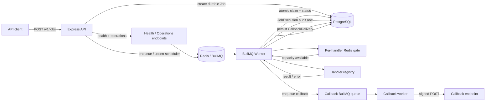

# Taskflow — Durable Job Scheduling & Queue System

[](https://github.com/AdemolaAdedoyin/taskflow/actions/workflows/ci.yml)

I built Taskflow as a backend-focused job scheduling service for work that needs to run later, retry safely, or execute on a recurring schedule. It combines PostgreSQL as the durable source of truth with Redis/BullMQ as the execution layer, and it deliberately focuses on the failure modes that make queue systems interesting: duplicate requests, partial Redis failures, cancellation races, overlapping recurring runs, retries, worker shutdown, recovery, reliable completion notifications, and noisy/expensive handler isolation.

**Stack:** Node.js, TypeScript, Express, PostgreSQL + Prisma, Redis + BullMQ, Zod, Pino, Vitest, OpenAPI/Swagger, Docker Compose, GitHub Actions.

## Portfolio highlights

- **Durable scheduling model** — job definitions live in PostgreSQL; Redis/BullMQ is treated as rebuildable execution infrastructure.
- **Idempotent creation and repair** — an `idempotencyKey` prevents duplicate durable jobs, and retries can repair a missing Redis projection after an ambiguous queue failure.
- **One-off + recurring scheduling** — delayed jobs use deterministic BullMQ IDs; recurring jobs use BullMQ v5 Job Schedulers.
- **Concurrency-safe execution** — first attempts atomically claim `SCHEDULED` jobs in PostgreSQL so cancellation and overlapping recurring ticks cannot both win.
- **Per-handler execution controls** — optional distributed concurrency leases and fixed-window rate limits isolate expensive handlers across worker replicas without consuming business retry attempts while waiting for capacity.
- **Retry audit trail** — BullMQ owns retry/backoff mechanics while every attempt is persisted as a `JobExecution` row.
- **Scalable execution history** — long-running recurring jobs expose cursor-paginated, filterable execution history instead of forcing unbounded relation loads.
- **Durable completion callbacks** — optional callbacks are stored before they are queued, delivered on a separate BullMQ queue, retried with backoff, HMAC-signed, SSRF-checked, and recoverable after Redis failures.
- **Security boundaries** — bearer-token authentication, configurable rate limits/CORS/proxy handling, SSRF defenses, redirect blocking, and production outbound-host allowlisting.
- **Operational visibility** — request IDs, structured logs, liveness/readiness probes, job-queue counts, callback-queue counts, configured handler limits, durable status counts, and process uptime.
- **Real integration coverage** — CI starts PostgreSQL and Redis, applies migrations, exercises the HTTP API and distributed Redis coordination, verifies durable rows and queue projections, then builds the TypeScript project and production container.

## Architecture



The important design choice is that PostgreSQL owns durable state. If Redis is unavailable immediately after a job or callback delivery is created, the durable row remains recoverable. Idempotent retries and startup reconciliation rebuild missing queue projections.

## Scheduling and execution flow

1. `POST /v1/jobs` validates the handler type, schedule, and optional callback configuration.
2. Taskflow creates the durable PostgreSQL `Job` row.
3. It projects that job into BullMQ using a deterministic one-off ID or a recurring Job Scheduler.
4. Before a handler starts, the worker checks any configured distributed concurrency/rate policy for that job type. Throttled jobs return to BullMQ's delayed set without becoming `RUNNING` or consuming an attempt.
5. Once capacity is available, the worker atomically claims the durable job before executing the handler.
6. Every actual attempt is recorded as a `JobExecution` with timing, result, or error details.
7. One-off jobs become `SUCCEEDED` or `FAILED`; recurring jobs return to `SCHEDULED` for the next tick unless cancelled.
8. When an execution reaches its final outcome, Taskflow persists a `CallbackDelivery` before enqueueing the signed callback on a separate queue.

## Built-in handlers

`log_message` writes a structured log message and is useful for smoke tests. `simulate_failure` deterministically fails a configured number of times before succeeding so retry/backoff behavior can be demonstrated without relying on a flaky external service. `http_request` performs outbound HTTP work, but production use is intentionally restricted: targets must pass SSRF validation and match `HTTP_ALLOWED_HOSTS`; redirects are disabled.

## API

The OpenAPI document is served at `/openapi.json`, with interactive Swagger UI at `/docs`.

| Endpoint | Purpose |
| --- | --- |
| `POST /v1/jobs` | Create a one-off or recurring job, optionally with a completion callback |
| `GET /v1/jobs` | Filter/list jobs |
| `GET /v1/jobs/:id` | Job detail + 20 most recent executions |
| `GET /v1/jobs/:id/executions` | Cursor-paginated execution history with status filtering |
| `POST /v1/jobs/:id/cancel` | Cancel a scheduled job safely |
| `GET /v1/operations/overview` | Authenticated job/callback queue, handler-limit, and durable-state overview |
| `GET /health/live` | Process liveness |
| `GET /health/ready` | PostgreSQL + Redis readiness |
| `GET /health` | Backward-compatible lightweight health endpoint |

Authenticated endpoints require:

```text
Authorization: Bearer <TASKFLOW_API_KEY>
```

Every request gets an `x-request-id`. A valid incoming ID is preserved; otherwise Taskflow generates one and returns it in the response.

Execution history uses an opaque cursor so a recurring job can accumulate a large audit trail without offset scans or duplicate rows between pages:

```bash
curl -H "Authorization: Bearer <your key>" \
  "http://localhost:4000/v1/jobs/<job-id>/executions?status=FAILED&limit=50"
```

Follow `pageInfo.nextCursor` until `pageInfo.hasMore` is false.

## Completion callbacks

A job can request a callback by supplying `callbackUrl` when it is created:

```json
{
  "type": "log_message",
  "payload": { "message": "notify me when this finishes" },
  "schedule": { "type": "once" },
  "callbackUrl": "https://api.example.com/taskflow/events"
}
```

Taskflow delivers a `POST` after a successful execution or after the final failed attempt. Recurring jobs can therefore emit one callback per completed firing. Delivery runs independently from the business handler, so a callback outage does not cause the original job to execute again.

Each request includes `x-taskflow-delivery-id` and `x-taskflow-signature`. The signature is `sha256=<hex>` where the hex value is HMAC-SHA256 over the exact raw request body using `CALLBACK_SIGNING_SECRET`. Consumers should verify the raw body before parsing JSON and make processing idempotent using the delivery ID.

Callbacks have their own retry/backoff policy and durable `CallbackDelivery` record. Redirects are not followed, targets are checked against private/reserved networks on every attempt, and production destinations must match `CALLBACK_ALLOWED_HOSTS`.

## Per-handler concurrency and rate limits

Global `JOB_CONCURRENCY` still caps each worker process, while optional per-handler policies coordinate capacity across all worker replicas through Redis. This is useful when, for example, `http_request` work should never occupy more than two slots globally while lightweight logging jobs remain unconstrained.

```env
HANDLER_CONCURRENCY_LIMITS=http_request:2,simulate_failure:4
HANDLER_RATE_LIMITS=http_request:30/60000
```

Concurrency values are maximum simultaneous executions for that handler. Rate values use `max/windowMs`, so `http_request:30/60000` allows 30 actual starts per 60-second window. If a policy blocks a job, Taskflow moves it back to BullMQ's delayed set before the PostgreSQL `RUNNING` transition. That waiting time does not increment `attemptCount` and does not create a `JobExecution` row.

Concurrency permits are expiring Redis leases and are renewed while the handler runs. If a worker crashes, the lease expires instead of reserving capacity indefinitely.

## Run locally

### Docker Compose

```bash
TASKFLOW_API_KEY=$(openssl rand -hex 24) docker compose up --build
```

The API is available at `http://localhost:4000` and Swagger UI at `http://localhost:4000/docs`.

### Local Node processes

```bash
cp .env.example .env
npm install
npm run prisma:generate
npm run prisma:migrate
npm run dev
```

In a second terminal:

```bash
npm run worker:dev
```

Optional example jobs:

```bash
TASKFLOW_API_KEY=<your key> npm run seed
```

## Example requests

Create a one-off job:

```bash
curl -X POST http://localhost:4000/v1/jobs \
  -H "Authorization: Bearer <your key>" \
  -H "Content-Type: application/json" \
  -d '{
    "type": "log_message",
    "payload": { "message": "run this later" },
    "schedule": { "type": "once", "runAt": "2026-09-12T20:00:00Z" },
    "idempotencyKey": "demo-once-1",
    "maxAttempts": 3
  }'
```

Create a recurring job:

```bash
curl -X POST http://localhost:4000/v1/jobs \
  -H "Authorization: Bearer <your key>" \
  -H "Content-Type: application/json" \
  -d '{
    "type": "log_message",
    "payload": { "message": "nightly cleanup" },
    "schedule": { "type": "recurring", "cron": "0 2 * * *", "timezone": "UTC" }
  }'
```

Inspect job state and recent attempts:

```bash
curl -H "Authorization: Bearer <your key>" \
  http://localhost:4000/v1/jobs/<job-id>
```

## Configuration

The main production-facing settings are documented in `.env.example`:

- `DATABASE_URL` / `REDIS_URL` — durable and queue infrastructure.
- `TASKFLOW_API_KEY` — shared bearer token; production requires at least 32 characters.
- `JOB_CONCURRENCY` — global business-job worker concurrency per worker process.
- `HANDLER_CONCURRENCY_LIMITS` — optional `handler:limit` entries coordinated across workers.
- `HANDLER_RATE_LIMITS` — optional `handler:max/windowMs` entries coordinated across workers.
- `HANDLER_LIMIT_RETRY_DELAY_MS` / `HANDLER_PERMIT_TTL_MS` — throttling retry cadence and concurrency-lease TTL.
- `CORS_ORIGINS` — explicit browser-origin allowlist.
- `HTTP_ALLOWED_HOSTS` — exact production allowlist for `http_request` jobs; an empty list disables them in production.
- `CALLBACK_ALLOWED_HOSTS` — exact production allowlist for completion callback destinations.
- `CALLBACK_SIGNING_SECRET` — HMAC secret used to sign callback bodies; use at least 32 random characters when callbacks are enabled in production.
- `CALLBACK_MAX_ATTEMPTS`, `CALLBACK_TIMEOUT_MS`, `CALLBACK_CONCURRENCY` — callback retry, timeout, and worker controls.
- `API_RATE_LIMIT_REQUESTS` / `API_RATE_LIMIT_WINDOW_MS` — API abuse protection.
- `TRUST_PROXY_HOPS` — set only behind a trusted reverse proxy.

## Testing and CI

Normal local unit tests do not require infrastructure:

```bash
npm test
```

For the real runtime integration suite, start PostgreSQL + Redis with the configured URLs and run:

```bash
RUN_INTEGRATION_TESTS=true npm test
```

GitHub Actions automatically runs the full path on every PR: dependency install, production dependency audit, Prisma generation/schema validation, migrations against a fresh PostgreSQL instance, unit + Postgres/Redis integration tests, TypeScript build, and production Docker image build.

## Reliability decisions

**Postgres before Redis.** Creating a job writes the durable definition first. If the queue write fails, the durable row is intentionally preserved so the operation can be repaired.

**Durable cancellation before queue cleanup.** Cancellation atomically changes `SCHEDULED -> CANCELLED` in PostgreSQL before attempting Redis cleanup. Even if cleanup fails, the worker cannot legitimately claim the job afterward.

**No fake cancellation of active handlers.** Arbitrary handler code cannot be safely pre-empted, so Taskflow returns a conflict instead of claiming that a `RUNNING` job was cancelled.

**Capacity waiting is not a business attempt.** Handler concurrency/rate checks happen before the durable `RUNNING` claim. A throttled job is delayed in BullMQ rather than failed, so it does not burn retry budget or pollute execution history.

**Crash-safe distributed concurrency.** Handler concurrency uses renewable expiring Redis leases. Normal completion releases immediately; a crashed worker eventually loses its permit through lease expiry.

**Cursor pagination for audit history.** Execution pages are ordered by `startedAt` and `id`, with an opaque cursor carrying both values. A matching composite PostgreSQL index keeps per-job history scans efficient and deterministic.

**Callbacks are a separate failure domain.** The callback intent is persisted before Redis enqueue and delivered by a separate worker with its own retries. A callback failure never changes a completed job back into a failed/retried business execution.

**Graceful shutdown.** The API stops accepting traffic before closing queue/Redis/Postgres resources; the worker stops taking new work and waits for active handlers and callback deliveries before disconnecting dependencies.

## Project layout

```text
src/
  modules/
    jobs/                 # HTTP validation + job service
    health/               # liveness/readiness
    operations/           # authenticated runtime overview
  queue/
    jobQueue.ts           # deterministic job enqueue / scheduler helpers
    handlerLimits.ts      # distributed handler concurrency/rate coordination
    callbackQueue.ts      # deterministic completion-callback queue
    callbackDelivery.ts   # durable callback lifecycle, signing, delivery
    reconcile.ts          # rebuild missing job/callback queue projections
    worker.ts             # jobs + callbacks + graceful shutdown
    handlers/             # pluggable job implementations
  lib/                    # cron, limit config parsing, SSRF protection, logging, errors
  middleware/             # auth + centralized error handling
  __tests__/
    integration/          # real Postgres + Redis runtime coverage
prisma/
  schema.prisma
  migrations/
openapi.yaml
.github/workflows/ci.yml
```

## Remaining roadmap

With per-handler execution controls added, the remaining portfolio phases are:

- **Phase 11 — stronger multi-client authentication/authorization** instead of one shared API key.
- **Phase 12 — metrics and deployment** with Prometheus/OpenTelemetry-style export plus a concrete managed PostgreSQL/Redis deployment example.
- **Final phase — API documentation and portfolio walkthrough.** Because Taskflow is intentionally backend-only, I will treat the API documentation as part of the product: tighten the OpenAPI contract, add complete request/response/error examples, callback-signature verification examples, an error/status catalog, deployment/runbook notes, architecture diagrams, and a guided curl/Swagger walkthrough that lets a reviewer understand and exercise the system without a frontend.
