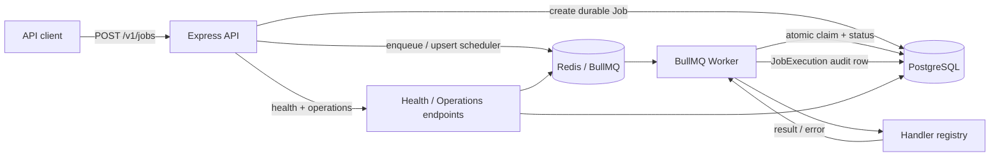

# Taskflow — Durable Job Scheduling & Queue System

[](https://github.com/AdemolaAdedoyin/taskflow/actions/workflows/ci.yml)

I built Taskflow as a backend-focused job scheduling service for work that needs to run later, retry safely, or execute on a recurring schedule. It combines PostgreSQL as the durable source of truth with Redis/BullMQ as the execution layer, and it deliberately focuses on the failure modes that make queue systems interesting: duplicate requests, partial Redis failures, cancellation races, overlapping recurring runs, retries, worker shutdown, and recovery.

**Stack:** Node.js, TypeScript, Express, PostgreSQL + Prisma, Redis + BullMQ, Zod, Pino, Vitest, OpenAPI/Swagger, Docker Compose, GitHub Actions.

## Portfolio highlights

- **Durable scheduling model** — job definitions live in PostgreSQL; Redis/BullMQ is treated as rebuildable execution infrastructure.
- **Idempotent creation and repair** — an `idempotencyKey` prevents duplicate durable jobs, and retries can repair a missing Redis projection after an ambiguous queue failure.
- **One-off + recurring scheduling** — delayed jobs use deterministic BullMQ IDs; recurring jobs use BullMQ v5 Job Schedulers.
- **Concurrency-safe execution** — first attempts atomically claim `SCHEDULED` jobs in PostgreSQL so cancellation and overlapping recurring ticks cannot both win.
- **Retry audit trail** — BullMQ owns retry/backoff mechanics while every attempt is persisted as a `JobExecution` row.
- **Security boundaries** — bearer-token authentication, configurable rate limits/CORS/proxy handling, SSRF defenses, redirect blocking, and production outbound-host allowlisting for `http_request` jobs.
- **Operational visibility** — request IDs, structured logs, liveness/readiness probes, queue counts, durable status counts, and process uptime.
- **Real integration coverage** — CI starts PostgreSQL and Redis, applies migrations, exercises the HTTP API, verifies durable rows and queue projections, then builds the TypeScript project.

## Architecture



The important design choice is that PostgreSQL owns durable state. If Redis is unavailable immediately after a job is created, the `SCHEDULED` row remains recoverable. An idempotent retry or startup reconciliation can safely recreate the queue entry.

## Scheduling and execution flow

1. `POST /v1/jobs` validates the handler type and schedule.
2. Taskflow creates the durable PostgreSQL `Job` row.
3. It projects that job into BullMQ using a deterministic one-off ID or a recurring Job Scheduler.
4. A worker atomically claims the durable job before executing the handler.
5. Every attempt is recorded as a `JobExecution` with timing, result, or error details.
6. One-off jobs become `SUCCEEDED` or `FAILED`; recurring jobs return to `SCHEDULED` for the next tick unless cancelled.

## Built-in handlers

`log_message` writes a structured log message and is useful for smoke tests. `simulate_failure` deterministically fails a configured number of times before succeeding so retry/backoff behavior can be demonstrated without relying on a flaky external service. `http_request` performs outbound HTTP work, but production use is intentionally restricted: targets must pass SSRF validation and match `HTTP_ALLOWED_HOSTS`; redirects are disabled.

## API

The OpenAPI document is served at `/openapi.json`, with interactive Swagger UI at `/docs`.

| Endpoint | Purpose |
| --- | --- |
| `POST /v1/jobs` | Create a one-off or recurring job |
| `GET /v1/jobs` | Filter/list jobs |
| `GET /v1/jobs/:id` | Job detail + recent execution history |
| `POST /v1/jobs/:id/cancel` | Cancel a scheduled job safely |
| `GET /v1/operations/overview` | Authenticated queue + durable-state overview |
| `GET /health/live` | Process liveness |
| `GET /health/ready` | PostgreSQL + Redis readiness |
| `GET /health` | Backward-compatible lightweight health endpoint |

Authenticated endpoints require:

```text
Authorization: Bearer <TASKFLOW_API_KEY>
```

Every request gets an `x-request-id`. A valid incoming ID is preserved; otherwise Taskflow generates one and returns it in the response.

## Run locally

### Docker Compose

```bash
TASKFLOW_API_KEY=$(openssl rand -hex 24) docker compose up --build
```

The API is available at `http://localhost:4000` and Swagger UI at `http://localhost:4000/docs`.

### Local Node processes

```bash
cp .env.example .env
npm install
npm run prisma:generate
npm run prisma:migrate
npm run dev
```

In a second terminal:

```bash
npm run worker:dev
```

Optional example jobs:

```bash
TASKFLOW_API_KEY=<your key> npm run seed
```

## Example requests

Create a one-off job:

```bash
curl -X POST http://localhost:4000/v1/jobs \
  -H "Authorization: Bearer <your key>" \
  -H "Content-Type: application/json" \
  -d '{
    "type": "log_message",
    "payload": { "message": "run this later" },
    "schedule": { "type": "once", "runAt": "2026-09-12T20:00:00Z" },
    "idempotencyKey": "demo-once-1",
    "maxAttempts": 3
  }'
```

Create a recurring job:

```bash
curl -X POST http://localhost:4000/v1/jobs \
  -H "Authorization: Bearer <your key>" \
  -H "Content-Type: application/json" \
  -d '{
    "type": "log_message",
    "payload": { "message": "nightly cleanup" },
    "schedule": { "type": "recurring", "cron": "0 2 * * *", "timezone": "UTC" }
  }'
```

Inspect job state and recent attempts:

```bash
curl -H "Authorization: Bearer <your key>" \
  http://localhost:4000/v1/jobs/<job-id>
```

## Configuration

The main production-facing settings are documented in `.env.example`:

- `DATABASE_URL` / `REDIS_URL` — durable and queue infrastructure.
- `TASKFLOW_API_KEY` — shared bearer token; production requires at least 32 characters.
- `JOB_CONCURRENCY` — worker concurrency.
- `CORS_ORIGINS` — explicit browser-origin allowlist.
- `HTTP_ALLOWED_HOSTS` — exact production allowlist for outbound HTTP jobs; an empty list disables them in production.
- `API_RATE_LIMIT_REQUESTS` / `API_RATE_LIMIT_WINDOW_MS` — API abuse protection.
- `TRUST_PROXY_HOPS` — set only behind a trusted reverse proxy.

## Testing and CI

Normal local unit tests do not require infrastructure:

```bash
npm test
```

For the real runtime integration suite, start PostgreSQL + Redis with the configured URLs and run:

```bash
RUN_INTEGRATION_TESTS=true npm test
```

GitHub Actions automatically runs the full path on every PR: dependency install, Prisma generation/schema validation, migrations against a fresh PostgreSQL instance, unit + Postgres/Redis integration tests, and the TypeScript build.

## Reliability decisions

**Postgres before Redis.** Creating a job writes the durable definition first. If the queue write fails, the durable row is intentionally preserved so the operation can be repaired.

**Durable cancellation before queue cleanup.** Cancellation atomically changes `SCHEDULED -> CANCELLED` in PostgreSQL before attempting Redis cleanup. Even if cleanup fails, the worker cannot legitimately claim the job afterward.

**No fake cancellation of active handlers.** Arbitrary handler code cannot be safely pre-empted, so Taskflow returns a conflict instead of claiming that a `RUNNING` job was cancelled.

**Graceful shutdown.** The API stops accepting traffic before closing queue/Redis/Postgres resources; the worker stops taking new work and waits for active handlers before disconnecting dependencies.

## Project layout

```text
src/
  modules/
    jobs/                 # HTTP validation + job service
    health/               # liveness/readiness
    operations/           # authenticated runtime overview
  queue/
    jobQueue.ts           # deterministic enqueue / scheduler helpers
    reconcile.ts          # rebuild missing queue projections
    worker.ts             # claim, execute, persist attempts, graceful shutdown
    handlers/             # pluggable job implementations
  lib/                    # cron, networking/SSRF protection, logging, errors
  middleware/             # auth + centralized error handling
  __tests__/
    integration/          # real Postgres + Redis runtime coverage
prisma/
  schema.prisma
  migrations/
openapi.yaml
.github/workflows/ci.yml
```

## Next steps

I would extend Taskflow next with paginated execution-history endpoints, callback/webhook delivery on job completion, per-handler concurrency/rate limits, stronger multi-client authentication/authorization, metrics export for Prometheus/OpenTelemetry, and a production deployment example using managed PostgreSQL and Redis.
